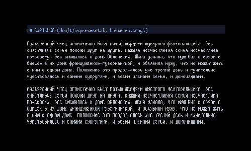
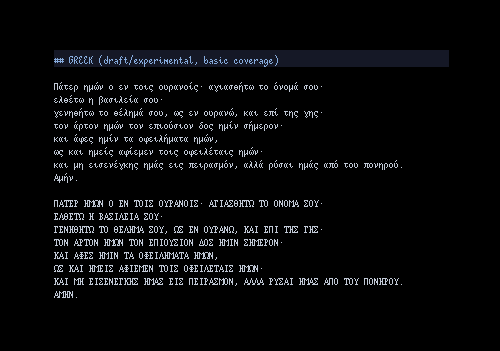

## Table of Contents

- [Table of Contents](#table-of-contents)
- [Overview](#overview)
- [Gallery](#gallery)
- [Installation](#installation)
  - [Manually Building](#manually-building)
- [Design Notes](#design-notes)
- [TODO](#todo)
- [Contributing](#contributing)
- [Credits](#credits)
- [Licensing](#licensing)

## Overview

> _An eccentric bitmap microfont for all your spellcasting needs._

**eldur** is a monospace bitmap font with a 5x13 bounding box (4px avg width,
3px descent, 10px ascent, 8px cap height). It takes strong inspiration from
[upright-italic
type](https://en.wikipedia.org/wiki/Italic_type#Upright_italics) to create a
font that aims to balance aesthetics, compactness and readability at the 4-5px
level.

Some glyphs come from [scientifica](https://github.com/nerdypepper/scientifica)
and [creep](https://github.com/romeovs/creep), often with modifications to
adhere to eldur's design.

## Gallery

## Installation

Download from [Releases](https://github.com/molarmanful/eldur/releases).
Included are bitmap formats - e.g. OTB, DFONT (Mac) - as well as TTF. 2x
versions are available for HiDPI screens.

For the crispiest viewing experience, try to use the bitmap formats when
possible. If bitmap fonts are not supported on your platform (e.g. Windows,
VSCode), then use the TTF at font sizes that are multiples of 13px.

> **Quick Tip**: If you need font size in pt, use the following conversion:
>
> `pt = px * 72 / dpi`
>
> e.g. 13px on a 96dpi screen is `13px * 72 / 96dpi = 9.75pt`.

### Manually Building

Requirements:

- Java (for [Bits'n'Picas](https://github.com/kreativekorp/bitsnpicas))
- [FontForge](https://fontforge.org)
- [bdfresize](https://github.com/ntwk/bdfresize) (e.g. `apt install bdfresize`)

`git clone` and run `build.sh`. Font files output to `out/`.

This method also downloads a Bits'n'Picas binary at `deps/`. If you wish, you
can use this binary (instead of or alongside FontForge) to view glyphs and
build desired font formats not found on the Releases page.

## Design Notes

A rather gnarly challenge with designing a font this small is that oftentimes,
characters have details that are important but difficult to fit within 4px -
e.g. the middle part of M/W. Here are some approaches for how I try to resolve
these problematic characters:

- **Alias the detail**: this is less desirable because it messes with
  readability. I more willingly use this approach for characters like letters
  that form parts of words (e.g.: M/W).
- **Expand to 5px**: this is less desirable because it messes with spacing. I
  more willingly use this approach for characters that generally appear by
  themselves or don't need the spacing to be legible.
- **Break the bounding box**: this is super-undesirable because it messes
  heavily with spacing and may mess up certain text renderers (unverified,
  needs testing). I use this as a last-resort to save certain characters from
  certain doom.

But this is not a perfect science, and not all characters are salvageable.

## TODO

In no particular order:

- More Unicode support
- Ligatures
- Nerd Fonts support/patch?

## Contributing

Issues, feature/glyph requests, and pull requests are all welcome!

## Credits

These are projects that have inspired/helped me create eldur and are 100% worth
checking out.

- [Bits'n'Picas](https://github.com/kreativekorp/bitsnpicas)
- [scientifica](https://github.com/nerdypepper/scientifica)
- [creep](https://github.com/romeovs/creep) / [creep2](https://github.com/raymond-w-ko/creep2)
- [Cozette](https://github.com/slavfox/Cozette)

## Licensing

Made with ♥ by Ben Pang. Released under the OFL-1.1 License.
